# Azure Functions でサーバーレス

## 概要

関数を使う事でコードが再利用でき、効率よくプログラムが書けます。Azure Functions はこの概念をさらに拡張したもので、クラウド上で単一の方法で管理でき、要求に応じて動的にスケールし、多くのサービスやシステムで共有できるイベント駆動側のサーバーレスアプリケーションとして開発できます。開発言語は C# をはじめとして、JavaScript, Python, Bash, PowerShell など様々な言語が利用でき、要求に応じて実行されるアプリケーションやナノサービスを開発する事ができます。

このラボでは、Azure Blog ストレージのコンテナを監視し、画像が追加された際に [Computer Vision API](https://www.microsoft.com/cognitive-services/en-us/computer-vision-api) を使って画像を解析する Azure Functions を開発します。この Azure Function は画像にアダルト要素や人種差別的なコンテンツが含まれていないかを解析します。問題が検知された場合、画像はあるコンテナにコピーされ、問題がない画像は異なるコンテナにコピーします。また、解析結果に含まれるスコアは、 blob のメタデータとして保存します。最後に Azure Logic App により、却下された画像については通知を行います。

以下の図で全体像を示します:


### 学習できる内容

このラボでは以下のことを学習します:

- Azure Function の作成
- Blob トリガーを使った Azure Function の開発
- Azure Function に対するアプリケーション設定の追加
- Cognitive サービスで画像を解析し、結果を blob にメタデータとして保存
- Logic Apps でサーバーレスワークフローを作成

### 前提条件

**推奨**: [Microsoft Azure Storage Explorer](http://storageexplorer.com) のインストール。PC に対して管理者権限がない場合は代わりに Azure ポータルの Web 画面を使えます。

### リソース

[ここをクリック](./resources/pictures.zip) してラボで使うリソースをダウンロードします。Zip ファイルの中身を任意のフォルダにコピーしておきます。
---

## 演習

このハンズオンラボは、以下の演習が含まれます:

- 演習 1: App Service プランと Azure Function の作成
- 演習 2: Azure Function の追加
- 演習 3: アプリケーション設定に対して Compute Vision API キーの追加
- 演習 4: Azure Function のテスト
- 演習 5: Blob メタデータの確認
- 演習 6: Logic App で却下された画像を通知
- 演習 7: チャレンジ: 承認ワークフローの作成

このラボは、約 **45-60** 分程度で完了します。

## 演習 1: App Service プランと Azure Function の作成

コードを書く前に、開発環境として Azure Function を作成する必要があります。また共有リソースの競合を避けるため、App Service プランを作成します。サービスプランを使用する以外にも、`重量課金プラン` を使うこともできます。詳細は [Azure Functions のスケールとホスティング](https://docs.microsoft.com/ja-jp/azure/azure-functions/functions-scale) を参照してください。

この演習では Azure ポータルで App Service プランと Azure Functions を作成します。同時に作成されるストレージアカウントに、画像アップロード用、アダルトまたは人種差別を含んだ画像、その他の画像用の 3 つの blob コンテナを作成します。

### タスク 1: App Service プランの作成

1. [Azure ポータル](https://portal.azure.com) にログインします。

1. **+ リソースの作成** をクリックして **App Service Plan** を検索します。
    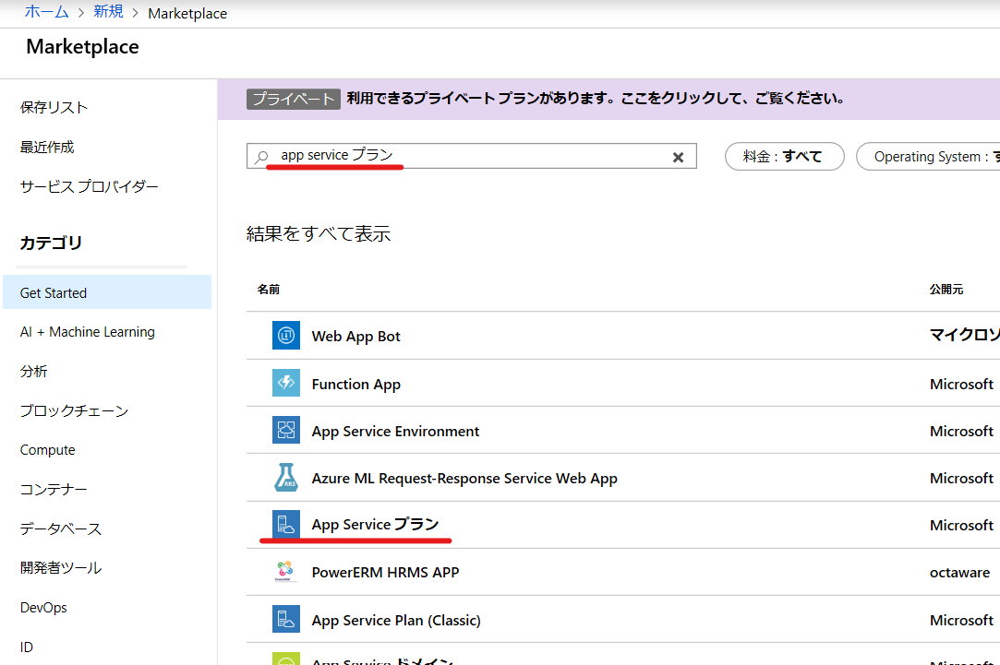

1. **作成** をクリックします。
    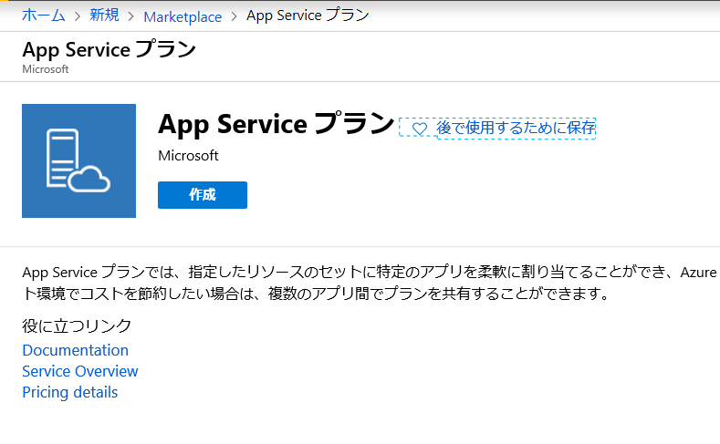

1. App Service プラン を構成します。構成を選択したら **確認と作成** をクリック。
    - リソースグループを指定、または新規作成 (ここでは RG001 を新規に作成)
    - Windows を選択
    - 近い地域を選択
    - SKU とサイズで 'Standard S1' を選択
    

1. **作成** をクリック.

1. デプロイが開始。
    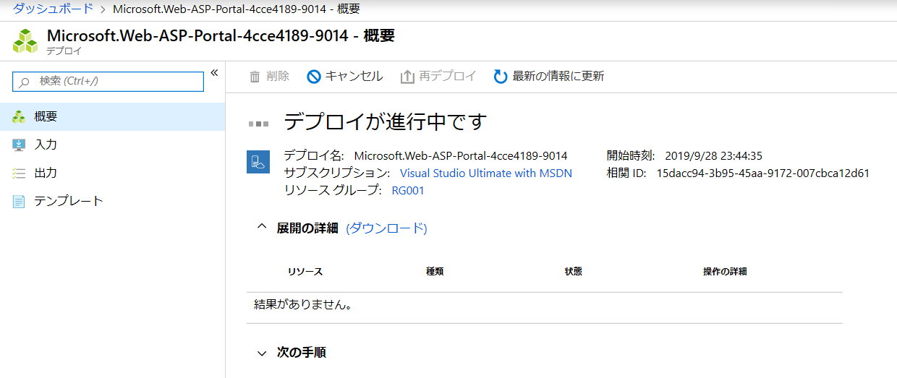

1. デプロイが完了したら **リソースに移動** をクリック。
    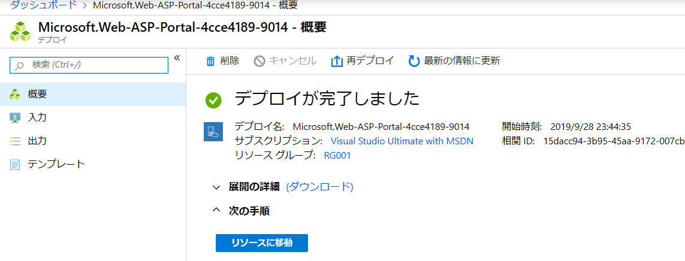

1. 概要のページが表示される。
    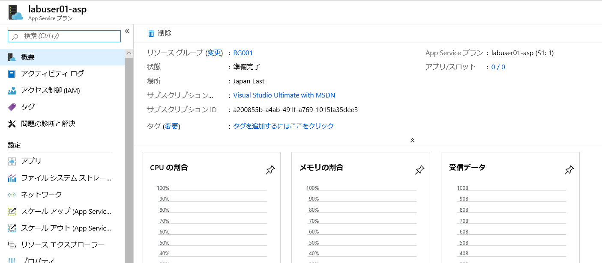

### タスク 2: Function App の作成

1. 次に作成した App Service プランを利用する Function App を追加。**+ リソースの作成** をクリックして**Function App** を検索して選択。次の画面で **作成** をクリック。
    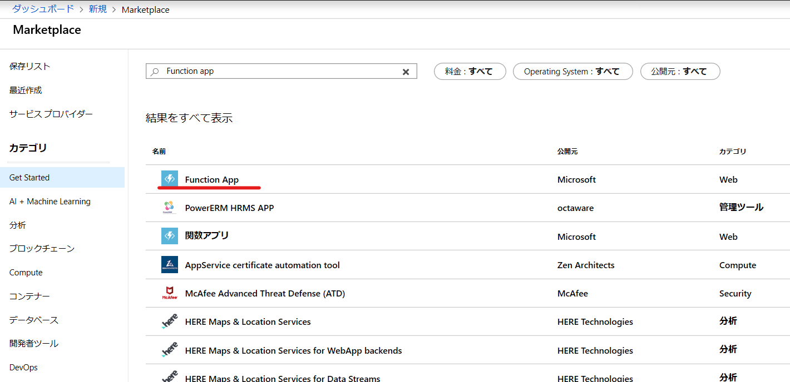

1. 詳細入力画面が表示されるので以下のように入力:
    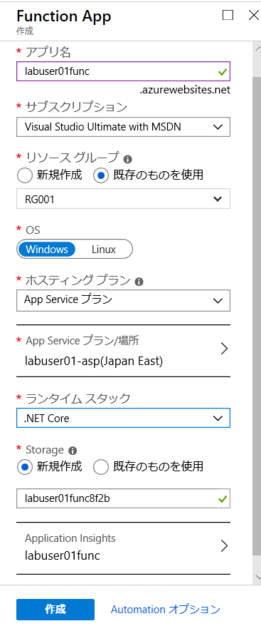

   **アプリ名** : グローバルで一意の名前を入力
    > この名前は DNS 名となる
   **Resource Group** : 既存のものを指定
   **OS** : Windows を選択
   **ホスティングプラン** : App Service プランを選択し、作成済のものを指定
   **ランタイム スタック** : .NET Core を指定
   **Storage** : 新規作成を選び、名前は既定を利用
   **Application Insight** : 既定のまま利用するを指定

1. **作成** をクリック。

### タスク 3: テストデータのアップロード

1. **リソースグループ**より Azure Function を作成したグループを選択。

    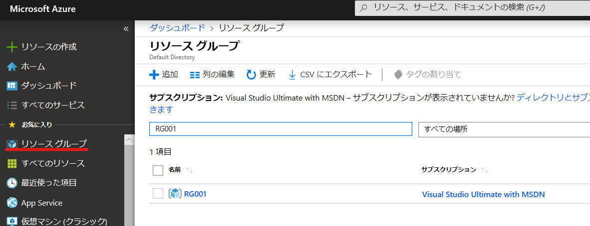

1. Function App の作成が完了すると以下のリソースが確認できる:
    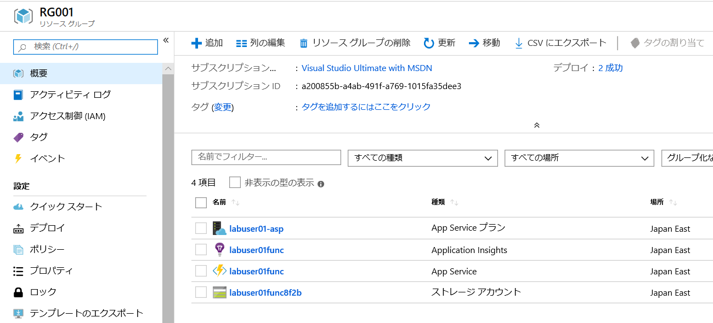

1. ストレージアカウントをクリックして **BLOG** をクリック。

    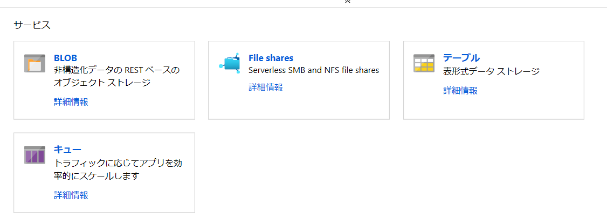

1. **+コンテナー**をクリックし、**名前**に `uploaded` と入力後、**OK** をクリック。

     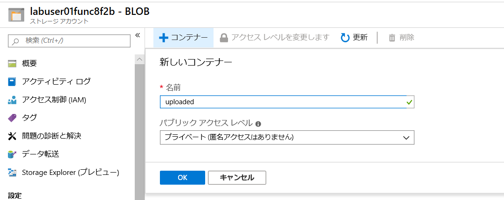

1. 同様に `accepted` および `rejected` コンテナを追加。

     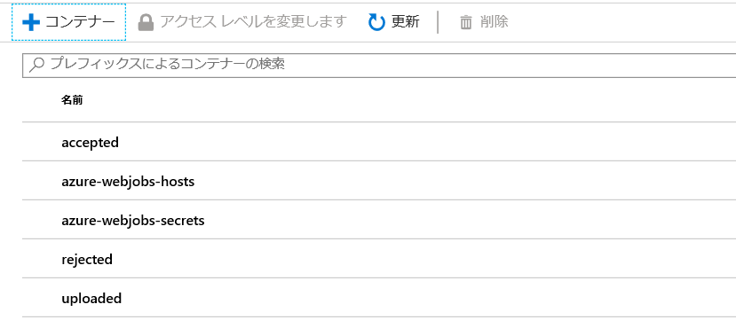

これで Azure Function と 3 つの blob コンテナが追加できました。次は Azure Function を実装していきます。

## 演習 2: Azure Function の実装

Azure Function を作成したので、実装を始めます。この演習では、[Computer Vision API](https://www.microsoft.com/cognitive-services/ja-jp/computer-vision-api) を使って、uploaded コンテナに追加された画像の解析を行う C# の関数を実装します。

1. リソースグループから Azure Function を選択。

    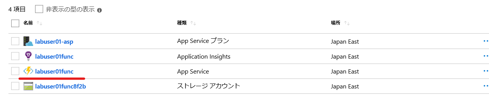

1. **関数**の右にある **+** をクリック。

    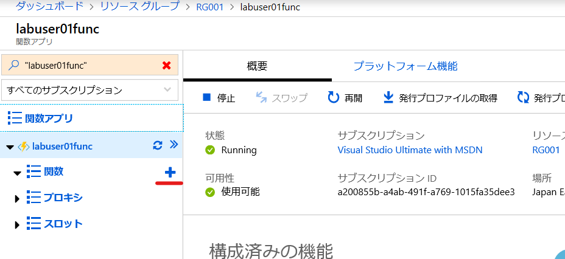

1. **ポータル内**をクリックし、画面下に出る**続行**をクリック。

    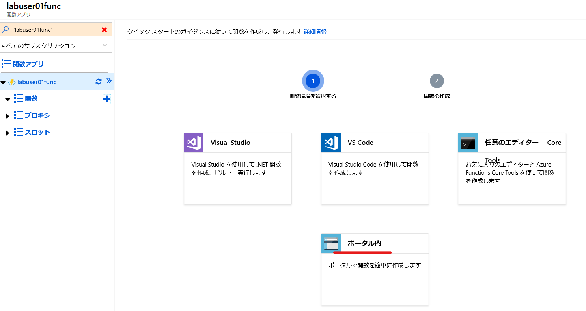

1. **その他のテンプレート**をクリックし、下に出る**テンプレートの完了と表示**をクリック。
  
    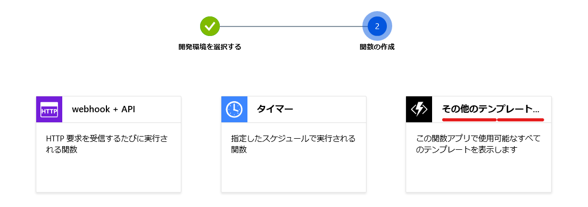

1. テンプレートの一覧より **Azure Blob Storage trigger** をクリック。

    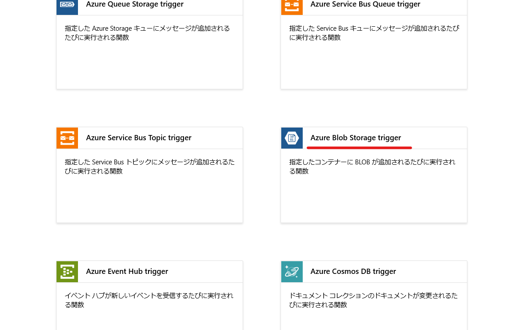

1. Azure Functions は最小限の機能を持つように設計されているため、Azure Blob Storage trigger などの機能については、作成時に別途拡張機能をインストールする仕組みとなっている。この Azure Function で初めて Blob ストレージトリガーを使う場合、インストールを促す画面が表示されるので、**インストール**をクリック。

    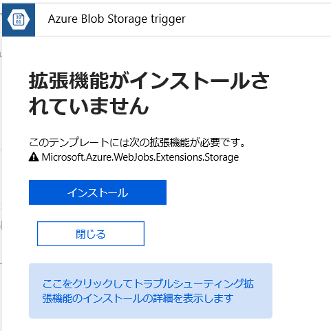

1. インストール完了までしばらく待機。インストールが完了したら**続行**をクリック。

    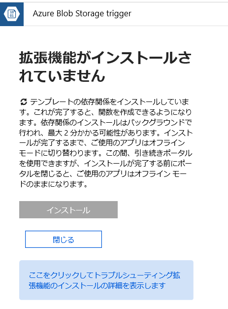

1. 関数名として `ClassifyImage` を指定し、パスとして `uploaded/{name}` を設定。**作成**をクリック。

    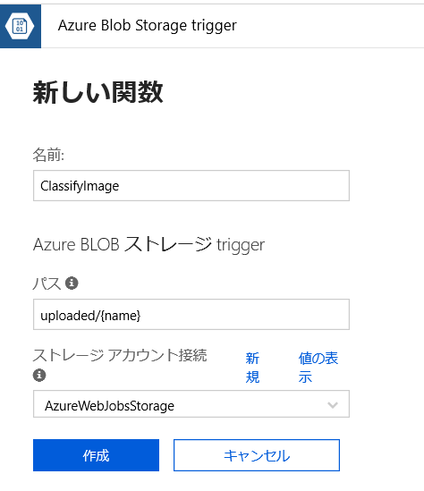

1. 作成された関数を以下のようになる。

    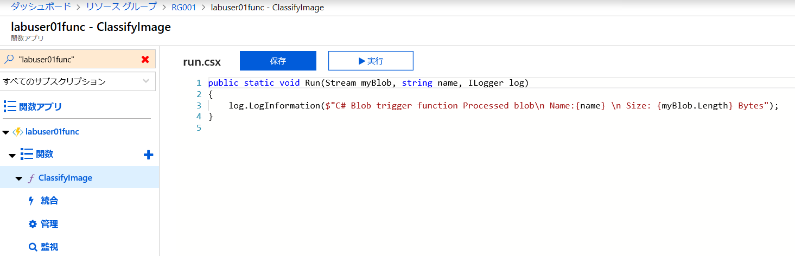

1. 中身を以下のコードに差し替え。

    ```C#
    #r "Microsoft.WindowsAzure.Storage"
    using Microsoft.WindowsAzure.Storage.Blob;
    using Microsoft.WindowsAzure.Storage;
    using System.Net.Http.Headers;

    public async static Task Run(Stream myBlob, string name, ILogger log)
    {
        log.LogInformation($"Analyzing uploaded image {name} for adult content...");
        log.LogInformation($"SubscriptionKey: {System.Environment.GetEnvironmentVariable("SubscriptionKey")}");
        log.LogInformation($"VisionEndpoint: {System.Environment.GetEnvironmentVariable("VisionEndpoint")}");
        log.LogInformation($"AzureWebJobsStorage: {System.Environment.GetEnvironmentVariable("AzureWebJobsStorage")}");

        var result = await AnalyzeImageAsync(myBlob, log);

        log.LogInformation("Is Adult: " + result.adult.isAdultContent.ToString());
        log.LogInformation("Adult Score: " + result.adult.adultScore.ToString());
        log.LogInformation("Is Racy: " + result.adult.isRacyContent.ToString());
        log.LogInformation("Racy Score: " + result.adult.racyScore.ToString());

        if (result.adult.isAdultContent || result.adult.isRacyContent)
        {
            // Copy blob to the "rejected" container
            await StoreBlobWithMetadata(myBlob, "rejected", name, result, log);
        }
        else
        {
            // Copy blob to the "accepted" container
            await StoreBlobWithMetadata(myBlob, "accepted", name, result, log);
        }
    }

    private async static Task<ImageAnalysisInfo> AnalyzeImageAsync(Stream blob, ILogger log)
    {
        HttpClient client = new HttpClient();

        var key = System.Environment.GetEnvironmentVariable("SubscriptionKey");
        client.DefaultRequestHeaders.Add("Ocp-Apim-Subscription-Key", key);

        HttpContent payload = new StreamContent(blob);
        payload.Headers.ContentType = new MediaTypeWithQualityHeaderValue("application/octet-stream");

        var endpoint = System.Environment.GetEnvironmentVariable("VisionEndpoint");
        var results = await client.PostAsync(endpoint + "vision/v2.0/analyze?visualFeatures=Adult", payload);
        var result = await results.Content.ReadAsAsync<ImageAnalysisInfo>();
        return result;
    }

    // Writes a blob to a specified container and stores metadata with it
    private async static Task StoreBlobWithMetadata(Stream image, string containerName, string blobName, ImageAnalysisInfo info, ILogger log)
    {
        log.LogInformation($"Writing blob and metadata to {containerName} container...");

        var connection = System.Environment.GetEnvironmentVariable("AzureWebJobsStorage").ToString();
        var account = CloudStorageAccount.Parse(connection);
        var client = account.CreateCloudBlobClient();
        var container = client.GetContainerReference(containerName);

        try
        {
            var blob = container.GetBlockBlobReference(blobName);

            if (blob != null)
            {
                // Set position of stream `image` to 0
                image.Seek(0, SeekOrigin.Begin);

                // Upload the blob
                await blob.UploadFromStreamAsync(image);

                // Get the blob attributes
                await blob.FetchAttributesAsync();

                // Write the blob metadata
                blob.Metadata["isAdultContent"] = info.adult.isAdultContent.ToString();
                blob.Metadata["adultScore"] = info.adult.adultScore.ToString("P0").Replace(" ","");
                blob.Metadata["isRacyContent"] = info.adult.isRacyContent.ToString();
                blob.Metadata["racyScore"] = info.adult.racyScore.ToString("P0").Replace(" ","");

                // Save the blob metadata
                await blob.SetMetadataAsync();
            }
        }
        catch (Exception ex)
        {
            log.LogInformation(ex.Message);
            throw;
        }
    }

    public class ImageAnalysisInfo
    {
        public Adult adult { get; set; }
        public string requestId { get; set; }
    }

    public class Adult
    {
        public bool isAdultContent { get; set; }
        public bool isRacyContent { get; set; }
        public float adultScore { get; set; }
        public float racyScore { get; set; }
    }
   ```

    ```Run``` メソッドが関数実行時に呼び出される。ここでは ```Run``` メソッド内で ```AnalyzeImageAsync``` メソッドに対して `uploaded` コンテナにアップロードされた画像のストリームオブジェクトを渡して、Computer Vision API で分析。その後 ```StoreBlobWithMetadata``` メソッド内で結果によって `accepted` か `rejected` コンテナに画像をコピー。

1. **保存**をクリックして保存を実行後、**実行**をクリックして関数を実行。画像はないので*"[...] The specified container does not exist."* が出ることを確認。

    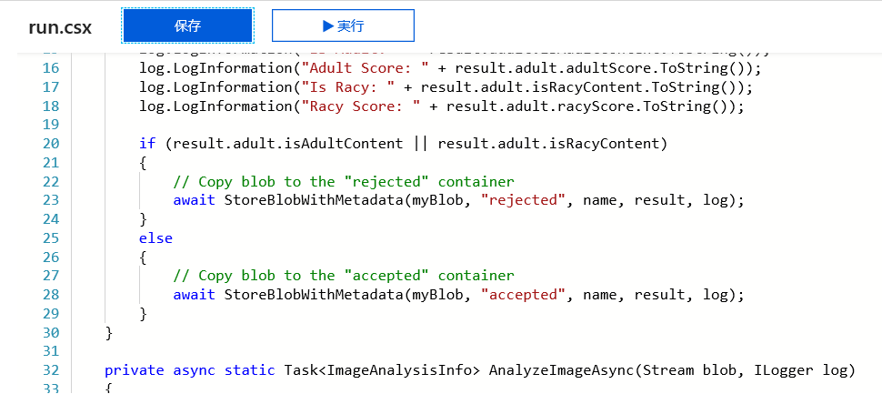

### まとめ

`uploaded` コンテナを監視する Azure Function を C# で作成しました。次に Computer Vision のキーなどを構成していきます。

## 演習 3: アプリケーション設定に対して Compute Vision API キーの追加

演習 2 で作成した関数は、Microsoft Cognitive サービス の Computer Vision API キーをアプリケーション設定から取得しようとします。キーは Computer Vision API を利用するために必要で、HTTP ヘッダーに入れて送られます。Computer Vision API の URL も同じく設定から読み込まれるため、この演習ではアプリケーション設定に必要な情報を追加していきます。

1. Azure CLI を使って Computer Vision サービスを作成。UI では指定できない設定を CLI で設定する。Azure ポータルから 画面右上にある Cloud Shell を起動。

    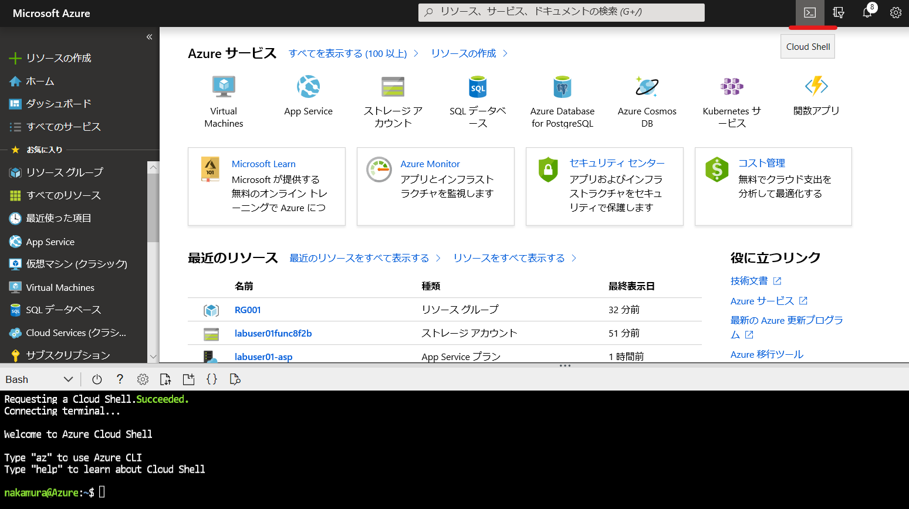

1. シェル内で以下のコマンドを実行。尚、リソースグループを名前は任意のものを指定。また `location` は japaneast を指定。

    ```sh
    az cognitiveservices account create --resource-group RG001 --name labuser01-cvapi --sku S1 --kind ComputerVision --location JapanEast --yes
    ```

1. 作成されると以下のような結果が表示される。

    ```sh
    [...]
    {
        "customSubDomainName": null,
        "endpoint": "https://japaneast.api.cognitive.microsoft.com/",
        "etag": "\"0c0063a1-0000-2300-0000-5d8f820b0000\"",
        "id": "/subscriptions/a200855b-a4ab-491f-a769-1015fa35dee3/resourceGroups/RG001/providers/Microsoft.CognitiveServices/accounts/labuser01-cvapi",
        "internalId": "0d0f063e2c0f4feb840a10fae1f15bd3",
        "kind": "ComputerVision",
        "location": "JapanEast",
        "name": "labuser01-cvapi",
        "networkAcls": null,
        "provisioningState": "Succeeded",
        "resourceGroup": "RG001",
        "sku": {
            "name": "S1",
            "tier": null
        },
        "tags": null,
        "type": "Microsoft.CognitiveServices/accounts"
    }
    ```

1. リソースグループより作成した Computer Vision API を選択。

    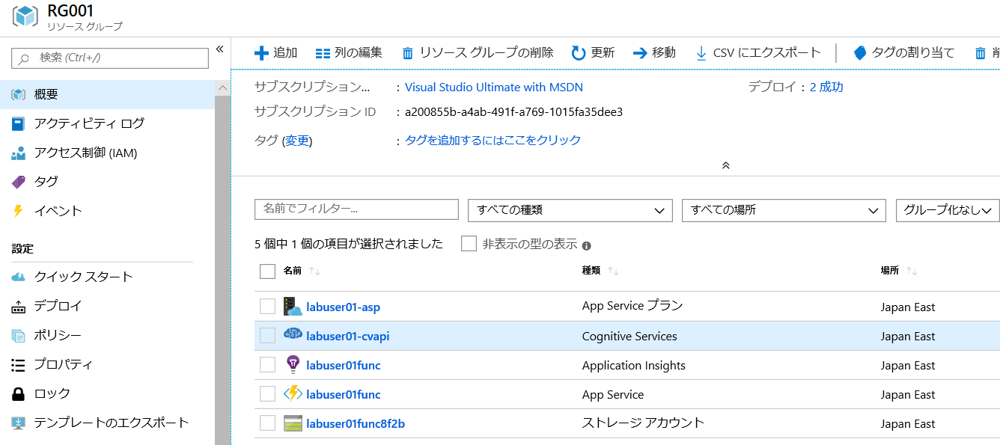

1. **Key1** と**エンドポイント**の値をコピーして保存しておく。

    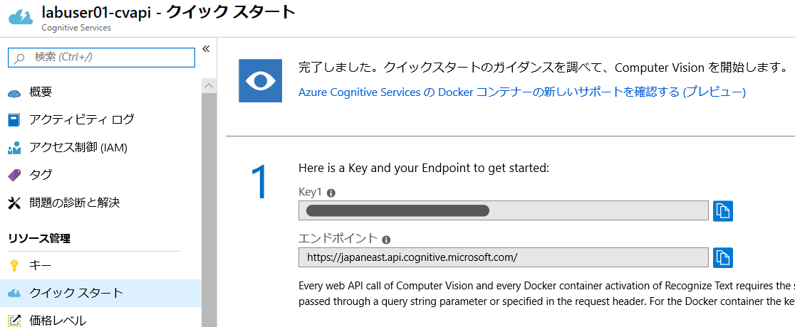

1. 作成した Function App に戻り、**構成**をクリック。

    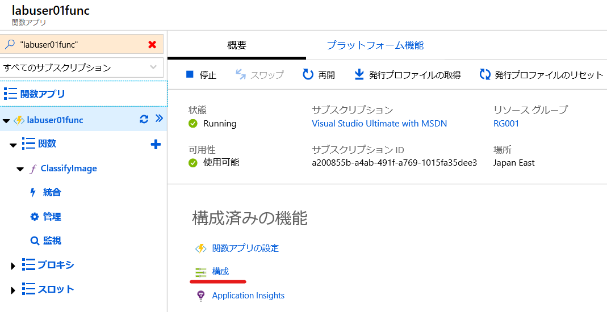

1. **アプリケーション設定**が表示されたら、**新しいアプリケーション設定**をクリック。

    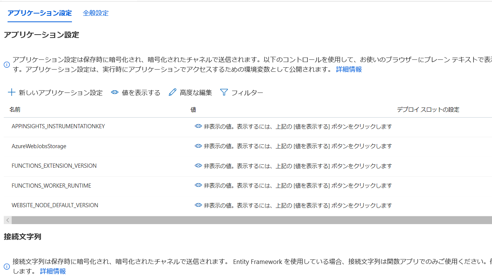

1. `SubscriptionKey` と `VisionEndpoint` をそれぞれ追加。値は先ほど取得したものを利用。

    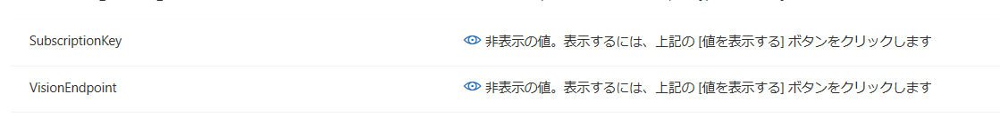

1. 画面上部にある**保存**をクリック。

    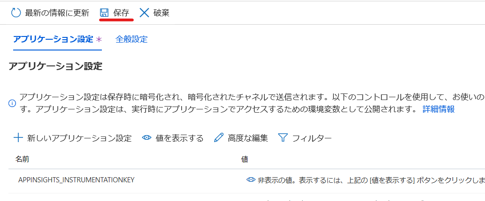

これでアプリケーション設定の保存は完了です。次はテストを行います。

## 演習 4: Azure Function のテスト

作成した Function App は `uploaded` コンテナを監視し、写真がアップロードされるたびに Computer Vision API で解析、結果に応じて `accepted` か `rejected` コンテナにコピーするよう実装してきました。この演習では意図通り動作するかテストします。

1. Azure ポータルより Function App 作成時に追加されたストレージアカウントを選択。

    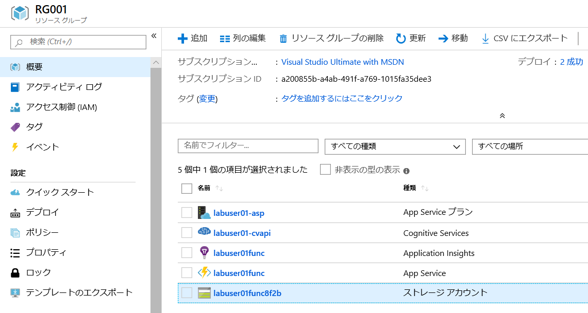

1. **BLOB**をクリック。

    

1. **uploaded** コンテナをクリック。

    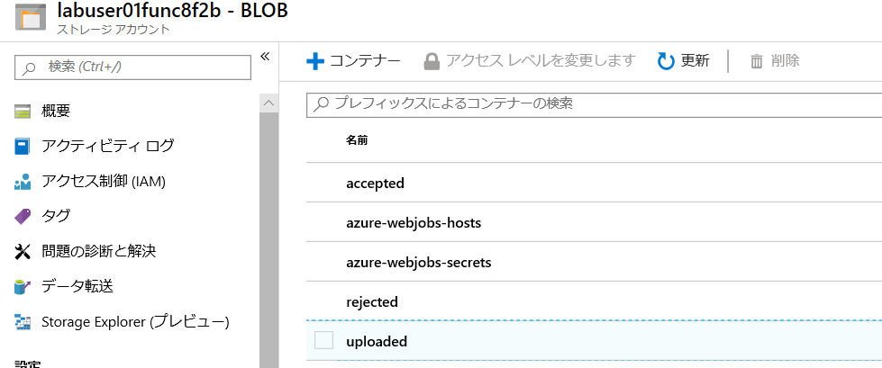

1. **アップロード**ボタンをクリック。

    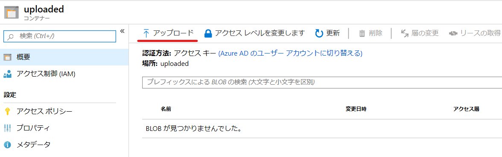

1. **ファイルの選択**右側にあるフォルダアイコンをクリック。ダウンロードしたラボ用リソースフォルダ内のすべてのファイルを選択してアップロード。リソースをまだ取得していない場合は、[ここをクリック](./resources/pictures.zip) してダウンロードした zip を解凍。

    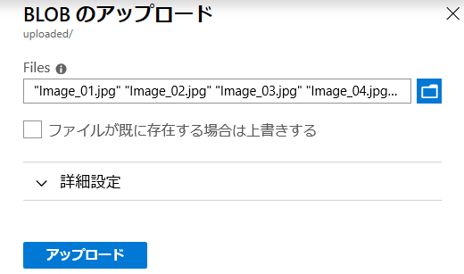

1. `uploaded` コンテナに 8 つの画像がアップロードされたことを確認。

    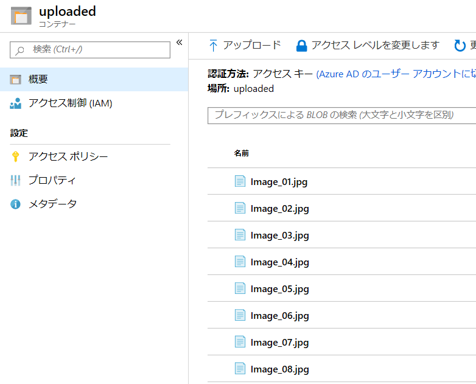

1. `uploaded` コンテナを閉じて `accepted` コンテナを開き、7 枚の写真があることを確認。**これらの写真は Computer Vision API によって問題ないと判定されたもの**。

    > `従量課金` を使っている場合、処理に時間がかかる場合があります。その際は**更新**を何度かクリックします。

    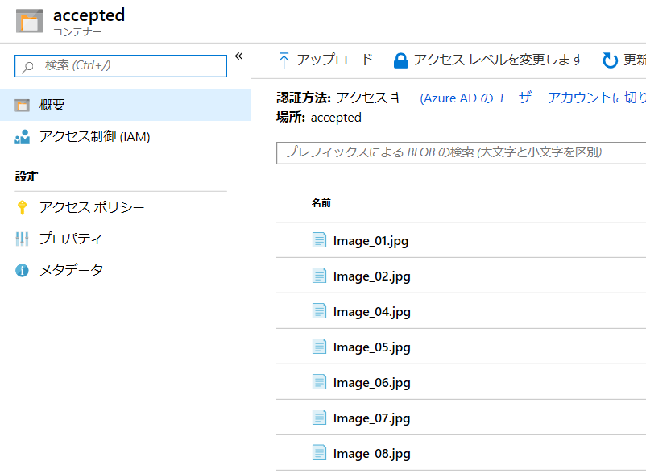

1.  `accepted` コンテナを閉じて `rejected` コンテナを開き、1 枚の写真があることを確認。**この写真は Computer Vision API によって問題があると判定されたもの**。

    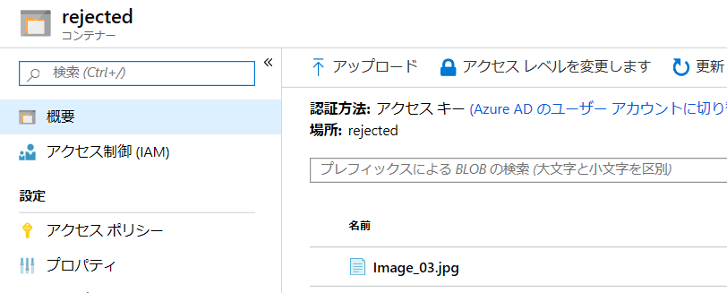

この結果より、写真が `uploaded` コンテナに保存する度、Function App がトリガーされ、画像を処理することがテストできました。処理の結果は Function App の**監視**からも確認可能です。

## 演習 5: Blob メタデータの確認

解析結果の詳細を見たい場合、`accepted` や `rejected` コピーされたオブジェクトのメタデータとして格納する事ができますが、Auzre ポータルからはメタデータを表示することができません。

この演習では、クロスプラットフォーム対応の [Microsoft Azure Storage Explorer](https://storageexplorer.com) を使って Computer Vision API の解析結果を確認します。scored the images you uploaded. **Alternatively,** you can also use the Azure ポータル and the built-in storage explorer.

1. まだ Storage Explorer をインストールしていない場合は、[https://storageexplorer.com](https://storageexplorer.com) よりインストール。Windows 版、Mac 版、Linux 版が提供される。

1. Storage Explorer を起動。ログインを求められるので Azure ポータルにログインしているアカウントでログインを実行。

1. 演習 1 で作成したストレージアカウントを選択し、`rejected` コンテナを選択。

    

1. 画像を右クリックして **Properties** をクリック。

    

1. メタデータを確認。*IsAdultContent* および *isRacyContent* はブール値であり、Computer Vision API でアダルトまたは人種差別的なコンテンツと判定されたかを示す。また *adultScore* と *racyScore* はそれぞれスコアを保持。

    

1. `accepted` コンテナを開き、いくつかの画像のメタデータを表示。`rejected` コンテナの画像のメタデータとの違いを確認。

これは、例えば写真を共有するサイトを運営する場合、問題がある画像を処理するために活用できます。Azure Function を使うとストレージに写真がアップロードされたタイミングで随時処理をするアプリケーションも容易に開発できます。

## 演習 6: Logic App で却下された画像を通知

1. **リソースの追加** より `logic` で検索して Logic Ap を追加。

    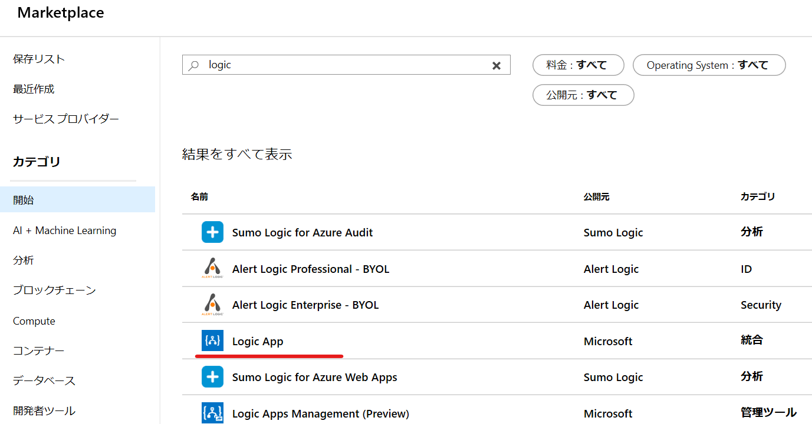

1. 名前を既存のリソースグループ、場所を設定して**作成**をクリック。

    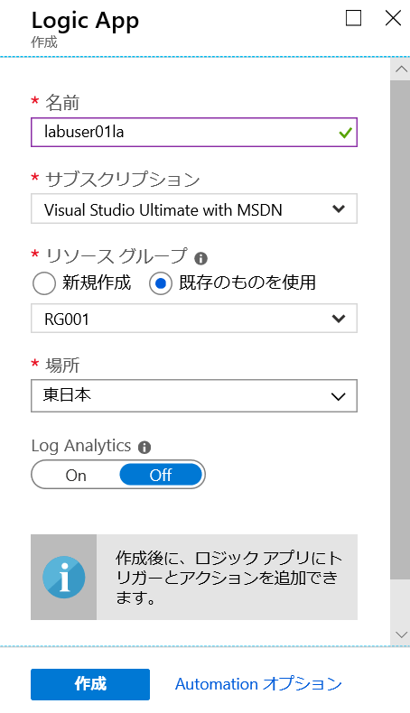

1. 作成が完了したら、テンプレート一覧より**空のロジック アプリ**を選択。

    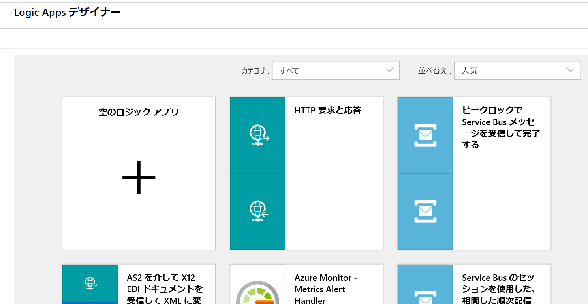

1. デザイナーが開いた後、**BLOB が追加または変更されたとき**を検索して追加。

    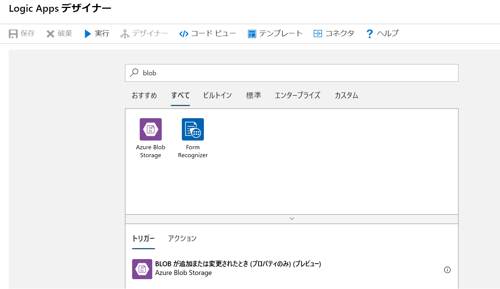

1. Azure Function で使っているストレージを接続として選択。

    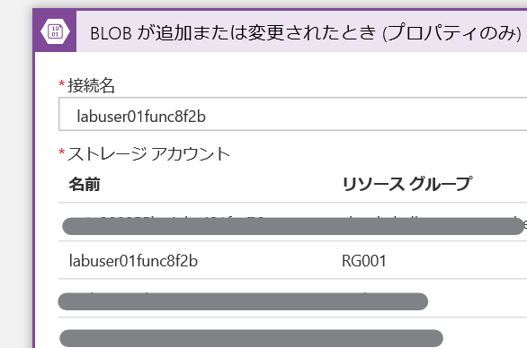

1. `rejected` コンテナを 1 分毎に確認するよう設定。また同時に取得する変更オブジェクトは 1 つに設定。

    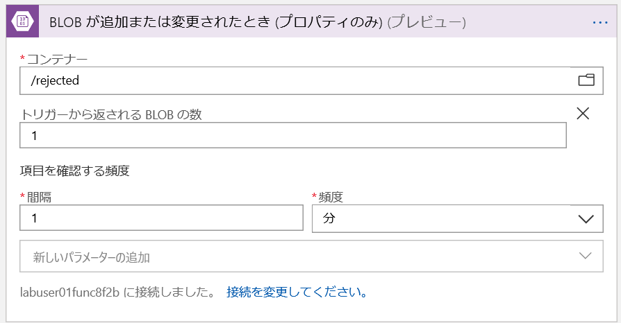

1. 次に**新しいステップ**をクリック後、**Office 365 Outlook** を検索して選択。

    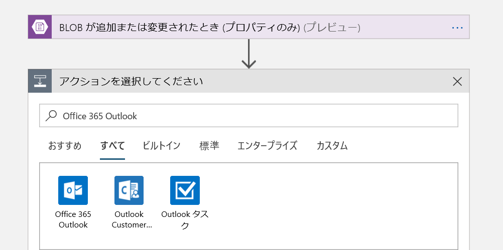

1. **メールの送信**を選択。

    

1. **サインイン**をクリックして自分のアカウントでサインイン。

    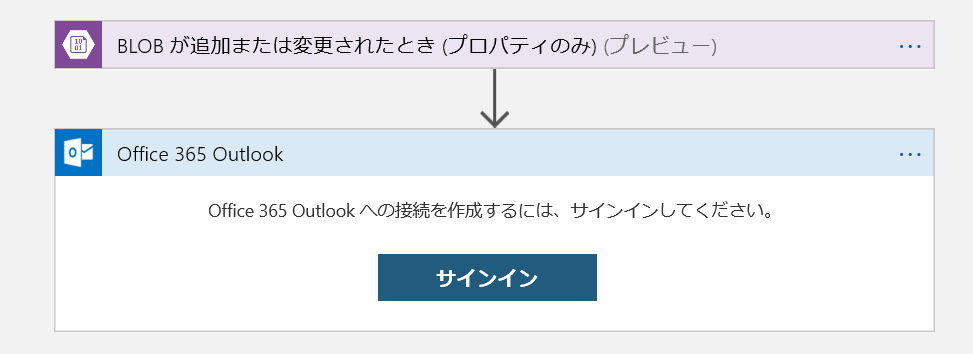

1. 任意の送信先を指定し、**本文**には `ファイルの一覧 DisplayName` を動的なプロパティより選択。

    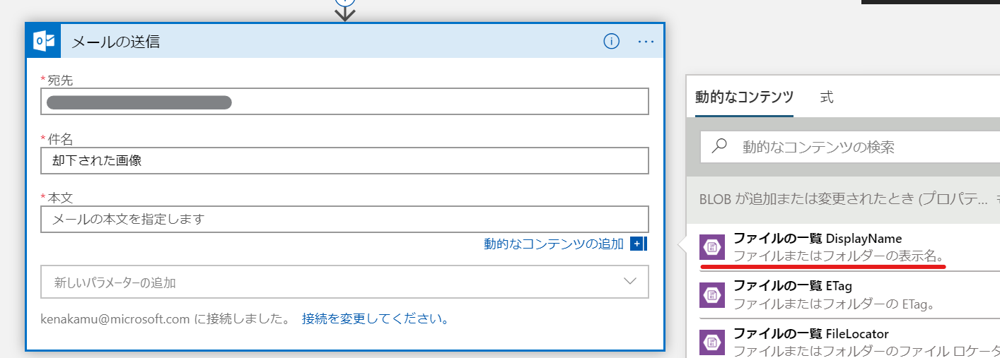

1. **保存**をクリック。

    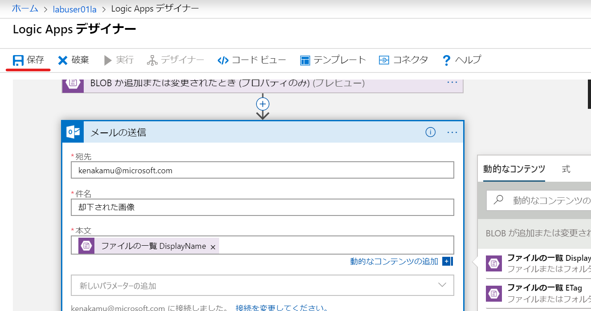

1. ワークフローは以上で設定が完了。ラボのリソースファイルより `Image_03.jpg` を `uploaded`フォルダにアップロード。メールを受信できるか確認。またプロセスの実行状況は Log App の概要からも確認が可能。

    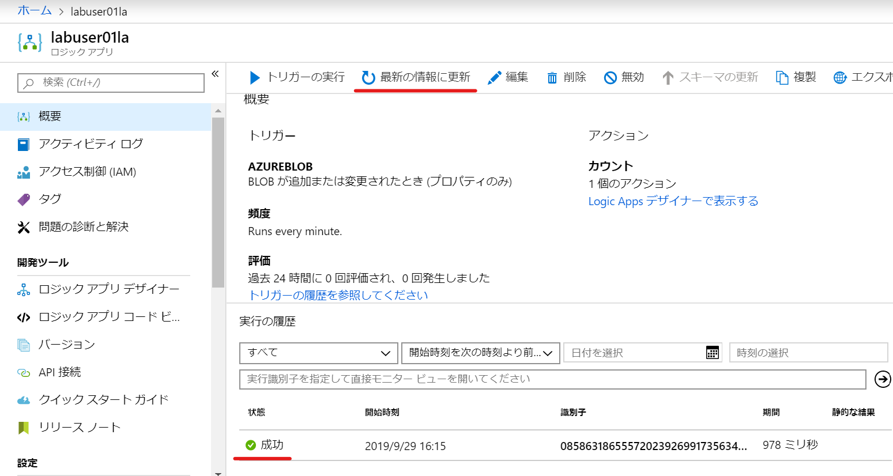

1. メールの受信も併せて確認。

    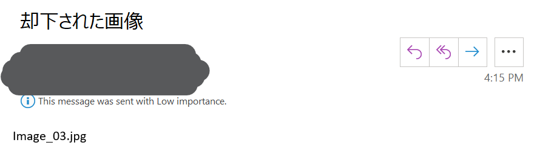

## 演習 7: チャレンジ: 承認ワークフローの作成

追加のチャレンジとして、是非以下のシナリオを実装してみてください。

- 承認ワークフローを作成
- 画像が `rejected` コンテナーに格納されたタイミングで承認ワークフローを実行
- 承認された画像は `accepted` コンテナーに移動
- 却下された画像は削除

> 演習 6 で似たようなワークフローを実装しましたが、一般的なシナリオである承認ワークフローがどのようにサーバーレスアプリケーションと連携できるかを学ぶことで、より現実的なソリューションを開発できるようになります。

## まとめ

このハンズオンでは、以下のことを学びました。

- Azure Function App の作成
- Blob と連携する Azure Function の実装
- アプリケーション設定の追加
- Microsoft Cognitive Services を使った画像の解析、および結果をメタデータとして保存
- Azure Logic Apps を使ったワークフローの作成

これらは Azure Function を使った繰り返し処理の 1 つのシナリオですが、他にも多くのテンプレートが提供されていますので、ビジネスに活用できる他のシナリオも是非試してみてください。
